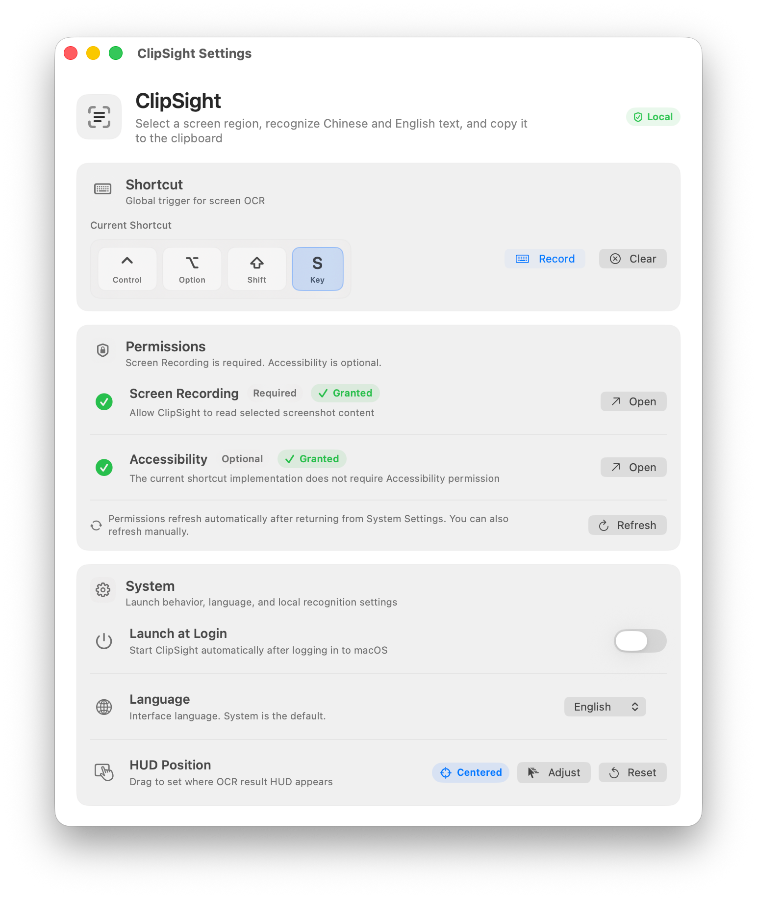

<p align="center">
  
</p>

<h1 align="center">ClipSight</h1>

<p align="center">
  Native macOS menu bar OCR powered by Apple Vision.
</p>

<p align="center">
  <a href="./README.md">中文</a> | <a href="./README.en.md">English</a>
</p>

<p align="center">
  <a href="LICENSE"></a>
  
  
</p>

ClipSight is a lightweight macOS menu bar app for local OCR. Trigger it from the menu bar or a custom global shortcut, select a screen region with the system screenshot picker, and ClipSight recognizes Chinese and English text locally before copying it to the clipboard.

ClipSight does not upload screenshots, call network OCR services, keep OCR history, or show recognized text in its result HUD.

## Features

- Native menu bar app with a compact macOS-style OCR result HUD.
- Local Chinese and English OCR via Apple Vision.
- System screenshot selection flow, with no custom capture overlay.
- Automatic clipboard copy after successful recognition.
- Configurable global shortcut.
- Settings window for shortcut, permissions, launch at login, interface language, and HUD placement.
- Lightweight diagnostics that omit OCR text and screenshot paths.

## Screenshots

<p align="center">
  
</p>

## Requirements

- macOS 13 Ventura or later
- Xcode or Xcode Command Line Tools
- Swift Package Manager

## Installation

Starting with the 0.4 release, official builds are Developer ID signed and notarized by Apple. Local ad-hoc builds remain available for development and early testing, but they are not recommended for regular distribution.

For the smoothest local install:

1. Download `ClipSight-0.4.0.zip` from the release page.
2. Unzip it and move `ClipSight.app` to `/Applications`.
3. Open it from Finder.
4. Grant Screen Recording permission when prompted.

If you download `ClipSight-0.4.0-local.zip`, that is a local ad-hoc signed build and macOS Gatekeeper may block it. For regular distribution, use the notarized zip without the `local` suffix.

## Usage

1. Launch `ClipSight.app`.
2. Open the ClipSight menu bar item.
3. Choose `Capture OCR` and select a region with the macOS screenshot UI.
4. When OCR finishes, ClipSight copies recognized text to the system clipboard and shows a result-only HUD.

ClipSight has no default global shortcut. Open `Settings...` and record your preferred shortcut.

## Permissions

ClipSight needs Screen Recording permission so the app can read the screenshot selected by the macOS system capture UI.

Accessibility permission is optional. The current global shortcut implementation uses Carbon hot key registration and does not require Accessibility permission.

## Language

The app defaults to System language. It shows Chinese when the system preferred language starts with `zh`; otherwise it shows English. You can also choose `中文` or `English` manually in Settings, and the change applies immediately.

OCR recognition always includes Simplified Chinese and English. Changing the interface language does not narrow OCR recognition languages.

## Development

Build the package:

```bash
swift build
```

Run the app locally:

```bash
./script/build_and_run.sh
```

Enable the hidden QA menu for HUD and placement checks:

```bash
CLIPSIGHT_ENABLE_QA_MENU=1 ./script/build_and_run.sh
```

Run tests:

```bash
./script/test.sh
```

The Vision OCR integration test is opt-in because it depends on the local Apple Vision runtime:

```bash
CLIPSIGHT_RUN_OCR_INTEGRATION=1 ./script/test.sh --filter OCRServiceIntegrationTests
```

## Packaging

Create a local ad-hoc signed app bundle:

```bash
./script/package_app.sh --distribution local
```

Verify the local bundle:

```bash
script/verify_release.sh --mode local
```

`local` mode validates bundle structure and code signing. Gatekeeper rejection is allowed for this ad-hoc build mode.

Create a Developer ID build for manual notarization:

```bash
CODESIGN_IDENTITY="Developer ID Application: Your Name" \
CLIPSIGHT_BUNDLE_ID="com.anrlm.ClipSight" \
MARKETING_VERSION="0.4.0" \
BUILD_NUMBER="1" \
./script/package_app.sh --distribution developer-id
```

Create a notarized release build when a notarytool keychain profile is available:

```bash
NOTARYTOOL_PROFILE="clipsight-notary" \
CODESIGN_IDENTITY="Developer ID Application: Your Name" \
CLIPSIGHT_BUNDLE_ID="com.anrlm.ClipSight" \
MARKETING_VERSION="0.4.0" \
BUILD_NUMBER="1" \
./script/package_app.sh --distribution notarized
```

Guarded local release script:

```bash
script/release.sh --version 0.4.0 --distribution notarized --push
```

Release checklist: [docs/release-checklist.md](docs/release-checklist.md)

## Privacy

OCR runs on device with Apple Vision. ClipSight does not upload screenshots, does not store OCR history, and does not include OCR text or screenshot paths in diagnostics.

## Troubleshooting

- Missing permission: grant Screen Recording permission in System Settings, then relaunch or return to ClipSight.
- Shortcut does not fire: confirm the shortcut is recorded and not already reserved by macOS or another app.
- No text recognized: try a higher contrast or larger text region. Very small, skewed, or complex multi-column content may fail.
- Local build blocked: local ad-hoc builds can be rejected by Gatekeeper. Developer ID signing and notarization are required for normal distribution.
- Stale permissions after rebuilding: toggle Screen Recording permission off and on for `ClipSight.app`.

## License

ClipSight is available under the [MIT License](LICENSE).
