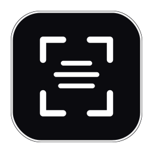
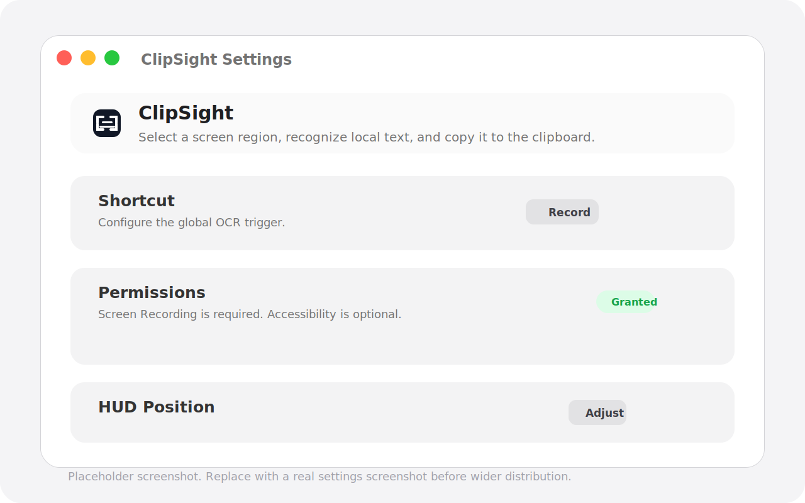

<p align="center">
  
</p>

<h1 align="center">ClipSight</h1>

<p align="center">
  原生 macOS 菜单栏 OCR 工具，基于 Apple Vision 在本机识别文本。
</p>

<p align="center">
  [中文](README.md) | [English](README.en.md)
</p>

<p align="center">
  <a href="LICENSE"></a>
  
  
</p>

ClipSight 是一个轻量的 macOS 菜单栏 OCR 应用。你可以从菜单栏或自定义全局快捷键触发系统截图框选，ClipSight 会在本机识别中文和英文文本，并自动复制到剪贴板。

ClipSight 不上传截图、不调用网络 OCR、不保存识别历史，也不会在结果提示框中展示 OCR 原文。

## 功能特性

- 原生菜单栏应用，提供紧凑的 macOS 风格 OCR 结果提示框。
- 使用 Apple Vision 在本机识别中文和英文。
- 使用 macOS 系统截图框选流程，不实现自定义截图遮罩。
- 识别成功后自动复制到系统剪贴板。
- 支持自定义全局快捷键。
- 设置页支持快捷键、权限、开机启动、界面语言和提示框位置。
- 诊断信息不会包含 OCR 原文或截图路径。

## 截图

<p align="center">
  
</p>

## 系统要求

- macOS 13 Ventura 或更高版本
- Xcode 或 Xcode Command Line Tools
- Swift Package Manager

## 安装

0.2 版本提供一个用于早期测试的本地 ad-hoc 签名 app zip。因为它没有使用 Developer ID 签名和公证，macOS Gatekeeper 可能会拦截。

本地测试安装：

1. 从 release 页面下载 `ClipSight-0.2.0-local.zip`。
2. 解压后将 `ClipSight.app` 移动到 `/Applications`。
3. 从 Finder 打开应用。如果 macOS 阻止启动，请在系统设置的“隐私与安全性”中允许该本地构建。
4. 按提示授予屏幕录制权限。

如果要正式分发，请使用 Developer ID 签名和公证构建，不要分发 local 包。

## 使用

1. 启动 `ClipSight.app`。
2. 点击菜单栏中的 ClipSight 图标。
3. 选择 `截图识别`，使用 macOS 系统截图界面框选区域。
4. OCR 完成后，ClipSight 会把识别文本复制到剪贴板，并显示只包含结果状态的提示框。

ClipSight 没有默认全局快捷键。请打开 `设置...` 录制你自己的快捷键。

## 权限

ClipSight 需要屏幕录制权限，以便读取 macOS 系统截图框选得到的图片内容。

辅助功能权限是可选项。当前全局快捷键使用 Carbon hot key 注册，不依赖辅助功能权限。

## 语言

应用默认同步系统语言，系统首选语言为中文时显示中文，否则显示英文。你也可以在设置页中手动选择 `中文` 或 `English`，切换会立即生效。

OCR 识别语言始终同时包含简体中文和英文，不会因为界面语言切换而缩窄识别范围。

## 开发

构建项目：

```bash
swift build
```

本地运行应用：

```bash
./script/build_and_run.sh
```

启用隐藏 QA 菜单，用于验证 HUD 和提示框位置：

```bash
CLIPSIGHT_ENABLE_QA_MENU=1 ./script/build_and_run.sh
```

运行测试：

```bash
./script/test.sh
```

Vision OCR 集成测试默认不运行，因为它依赖本机 Apple Vision 运行环境：

```bash
CLIPSIGHT_RUN_OCR_INTEGRATION=1 ./script/test.sh --filter OCRServiceIntegrationTests
```

## 打包

创建本地 ad-hoc 签名 app bundle：

```bash
./script/package_app.sh --distribution local
```

验证本地包：

```bash
script/verify_release.sh --mode local
```

`local` 模式会验证 bundle 结构和代码签名。Gatekeeper 拒绝 local ad-hoc 构建是允许结果。

创建 Developer ID 构建：

```bash
CODESIGN_IDENTITY="Developer ID Application: Your Name" \
CLIPSIGHT_BUNDLE_ID="com.example.ClipSight" \
MARKETING_VERSION="0.2.0" \
BUILD_NUMBER="1" \
./script/package_app.sh --distribution developer-id
```

如果已经配置 notarytool keychain profile，可以提交公证：

```bash
NOTARYTOOL_PROFILE="clipsight-notary" \
CODESIGN_IDENTITY="Developer ID Application: Your Name" \
CLIPSIGHT_BUNDLE_ID="com.example.ClipSight" \
./script/package_app.sh --distribution developer-id
```

发布检查清单：[docs/release-checklist.md](docs/release-checklist.md)

## 隐私

OCR 使用 Apple Vision 在本机执行。ClipSight 不上传截图，不保存 OCR 历史，诊断信息也不会包含 OCR 原文或截图路径。

## 故障排查

- 缺少权限：在系统设置中授予屏幕录制权限，然后重新启动或切回 ClipSight。
- 快捷键无响应：确认快捷键已经录制，并且没有被 macOS 或其他应用占用。
- 未识别到文本：尝试选择对比度更高、字号更大的区域。过小、倾斜或复杂多列内容可能无法识别。
- 本地构建被拦截：local ad-hoc 构建可能被 Gatekeeper 拒绝。正式分发需要 Developer ID 签名和公证。
- 重新构建后权限失效：在系统设置中关闭再重新开启 `ClipSight.app` 的屏幕录制权限。

## License

ClipSight 使用 [MIT License](LICENSE) 发布。
